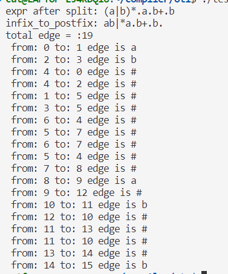

# 编译原理实验文档说明
## 2114036 曹骜天
# 正规式->NFA的算法实现(thompson构造法)
为了便于后续thompson构造法的实现，我们首先考虑将一个输入的正规式先转换成后缀表达式，这样能够便于字符流的读取，同时也能够方便后续的NFA的构造。

## 正规式->后缀表达式
为了表示出连接(join)运算符，需要将输入的字符流进行预处理，将连接运算符用`.`表示，例如:正则表达式`(a|b)*ab+b`会被转换成`(a|b)*.a.b+.b`的形式。然后再替换成后缀表达式：`ab|*a.b+.b.`。

对于前半部分的实现较为简单，只需对相邻的两个输入字符first与second进行判断,当且仅当sencond是字母或者'('，first不是'('和'|'时需要分割：
```c++
string split_join_symbol(string input)
{
...
        if(first!='(' && first!='|' && (isalpha(second) || second=='('))
        {
            ...
        }  
...
}
```

对于中缀转后缀的实现，我们的运算原则如下：
1. '*'='+'>'|'>'.'
2. 有括号先算括号
3. 相同优先级从左到右

首先需要定义优先级表，关于优先级表的说明参考：[csdn博客](https://blog.csdn.net/qq_43432875/article/details/102515831)。需要定义栈内优先级与栈外优先级如下：其中isp表示栈内优先级，icp表示栈外优先级。"/"表示或运算。可以看到在运算符相同的情况下，栈内优先级比栈外优先级要高，这是由于从左至右的运算原则。至于#是为了和栈底的#进行比较而定义的。我们会将#加在字符串末尾，并把一个#在初始时入栈。


|op|#|(|*,+|.|"/"|)||
|:-:|:-:|:-:|:-:|:-:|:-:|:-:|:-:|
|isp|0|1|7|5|3|8||
|icp|0|8|6|4|2|1||

在实现方面，对于栈顶元素和当前读取的字符，我们遵循以下原则：
1. 若输入的字符为字母，则直接加入到结果的后缀字符串中。
2. 若栈内优先级大于栈外优先级，则当前字符入栈。
3. 若栈内优先级小于栈外优先级，则栈顶元素出栈，并且加入到结果的后缀字符串中，然后继续比较栈顶元素和当前字符。
4. 若栈内优先级等于栈外优先级，则栈顶元素出栈，但是不加入到结果的后缀字符串中，因为遇到了右括号或者'#'，然后继续比较栈顶元素和当前字符。

就这样，可以得到后缀表达式，在后续的分析中只需从左到右分析表达式，利用Thompson构造法就可以得到NFA，而无需考虑优先级关系。对于转换成后缀表达式的具体实现，定义在如下函数中：
```c++
//中缀转后缀，便于后续处理
string infix_to_postfix(string input);

//栈内优先级
int isp(char in);

//栈外优先级
int icp(char in);
```

## 后缀表达式->NFA
首先，为了表示NFA，需要定义一些数据结构以及操作函数，`state`表示状态，目前只存放状态的id，`edge`表示状态转换图中的边，包含了开始和到达两个状态，以及边所对应的字符三个元素。`NFA_unit`为一个NFA单元，由边的集合，边的数目，开始状态和终态这几个部分组合而成，最后我们算法执行的结果将会返回一个`NFA_unit`的变量：
```c++
//便于后续处理，为状态定义结构体
struct state
{
    int state_name;
};

//由于是NFA，所以不在状态中定义边
struct edge
{
    state start_state;
    state end_state;
    //边所对应的词素
    char symbol;
};
//定义NFA单元
struct NFA_unit
{
    edge egde_set[MAX_EDGE_NUM];
    int edge_count;
    //整个NFA的初态和终态
    state init_state;
    state final_state;
};
//创建新状态
state create_state();
//创建新边
edge create_edge(state start,state end,char symbol);
```
对于不同的运算符，我们分别定义了不同的函数来进行处理，先进行总体的概览：
```c++
//处理单个符号
NFA_unit* single_rule(char in);

//处理连接“.”运算
NFA_unit* op_join(NFA_unit* front,NFA_unit* back);

//处理或"|"运算
NFA_unit* op_or(NFA_unit* a,NFA_unit* b);

//处理"*"运算
NFA_unit* op_closure(NFA_unit* a);

//处理"+"运算
NFA_unit* op_Rclosure(NFA_unit* a);
```
其中，对于单个字符的输入，首先会经过`single_rule`函数，其实就是利用thompson构造法的规则将它变为一个基本的`NFA_init`结构体，这个实现起来较为简单，只需要新建一个初态和一个终态，并且生成一条由初态指向终态的边即可。最后将这些信息存入新初始化的一个`NFA_init`结构体的指针里，将边、状态以及边的总数更新，最后返回这个指针即可：
```c++
NFA_unit* single_rule(char in)
{
    NFA_unit* New_unit=new NFA_unit;
    New_unit->edge_count=0;
    state state1=create_state();
    state state2=create_state();
    edge new_edge=create_edge(state1,state2,in);
    //构建NFA_unit
    New_unit->egde_set[New_unit->edge_count++]=new_edge;
    New_unit->init_state=new_edge.start_state;
    New_unit->final_state=new_edge.end_state;
    return New_unit;
}
```
对于连接运算，我们需要将两个`NFA_init`结构体连接起来，这里我们需要注意的是，连接运算是从左到右的，所以我们需要增加一条连接边，将第一个`NFA_init`结构体的终态和第二个`NFA_init`结构体的初态连接起来，这样才能保证连接运算的正确性。由于返回的是一个新的`NFA_init`结构体指针，所以不妨保存在传入参数的第一个`NFA_init`结构体指针中，这样可以节省空间，也只需要将第二个`NFA_init`的边复制到其边的集合中即可。同时也不会影响到后续的运算。具体实现如下：
```c++
NFA_unit* op_join(NFA_unit* front,NFA_unit* back)
{
    //增加一条连接边
    edge new_edge=create_edge(front->final_state,back->init_state,'#');
    front->egde_set[front->edge_count++]=new_edge;
    //最后返回的是front，将back的边复制到front中
    for(int i=0;i<back->edge_count;i++)
    {
        front->egde_set[front->edge_count++]=back->egde_set[i];
    }
    //更新final_state
    front->final_state=back->final_state;
    return front;
}
```
对于或运算，我们需要新建一个初态和一个终态，然后将这两个`NFA_init`结构体的初态和终态分别连接到新建的初态和终态上，也就是需要添加4条边。这样就可以保证或运算的正确性。同样的，我们可以将结果保存在第一个参数当中返回。具体实现如下：
```c++
NFA_unit* op_or(NFA_unit* a,NFA_unit* b)
{
    state new_init_state=create_state();
    state new_final_state=create_state();
    //新增四条连接边
    edge new_edge[4];
    new_edge[0]=create_edge(new_init_state,a->init_state,'#');
    new_edge[1]=create_edge(new_init_state,b->init_state,'#');
    new_edge[2]=create_edge(a->final_state,new_final_state,'#');
    new_edge[3]=create_edge(b->final_state,new_final_state,'#');
    //同样结果保存在a中，先复制b的边
    for(int i=0;i<b->edge_count;i++)
    {
        a->egde_set[a->edge_count++]=b->egde_set[i];
    }
    for(int i=0;i<4;i++)
        a->egde_set[a->edge_count++]=new_edge[i];
    //修改初态和终态
    a->init_state=new_init_state;
    a->final_state=new_final_state;
    return a;
}
```
对于闭包运算，根据Thompson构造法，也需要添加四条边，只是边的连接方式不同，这里不再赘述，大致思路和之前一致。同时，对于正则闭包，只少了一条边而已，这里也省略。

最后，利用后缀表达式和栈的特性，即字符直接封装成`NFA_init`结构体然后入栈，遇到运算符就从栈中弹出相应的`NFA_init`结构体，然后进行运算，最后将结果再次入栈，直到遍历完整个后缀表达式，最后栈中只剩下一个`NFA_init`结构体，这个结构体就是最终的结果。

# 实验结果分析
测试样例：(a|b)*ab+b

测试结果：



经检验该结果正确，包含了所有的状态和边，同时也符合Thompson构造法的规则。
项目代码连接：[github](https://github.com/cat0108/compiler_lab_ot1)
